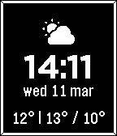

# My Pebble watch face

This is the watch face i run on my Pebble 2 Duo.
It is a combination of bits from other watch faces that i like, and it pulls data from YR.no. 

It shows a battery warning when below 25%, a UV index warning when index is above 3, and a rain warning when expected precipitation is above 1 mm.

